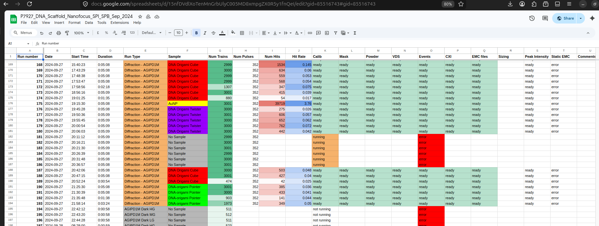

# xfel10662
3D Diffractive Imaging of Single-Protein with Hard X-ray Laser at the SFX/SPB instrument 

## Files
```text
Experiment root  : /gpfs/exfel/exp/SPB/.../
AGIPD Data       : /gpfs/exfel/exp/SPB/.../raw/r*/RAW*AGIPD*.h5
Meta  Data       : /gpfs/exfel/exp/SPB/.../raw/r*/RAW*DA*.h5
AGIPD (corrected): /gpfs/exfel/exp/SPB/.../proc/r*/COR*AGIPD*.h5
Analysis scripts : /gpfs/exfel/exp/SPB/.../usr/Shared/<user>/
Analysis files   : /gpfs/exfel/exp/SPB/.../scratch/<user>/
```

## Pipeline
```text
XFEL Data (/raw)
   └► facility calibrations (/proc/r*/CORR*)
   └► per-cell powder (/scratch/powder/r*_powder.h5)
     └► per-cell mask  (/scratch/det/r*_mask.h5)
        └► event info (/scratch/events/r*_events.h5)
          └► per-cell per-cell powder hits non-hits (/scratch/powder/r*_powder.h5)
            └► background estimation (events file)
              └► cxi files for hits (/scratch/hits/r*_hits.cxi)
                ├► sizing (cxi file)
                ├► static EMC (/scratch/emc_static/r*_emc_static.h5)
                └► 2D EMC (/scratch/emc_2D/r*_emc_2D.h5)
                  └► classification (write to event info)
                    └► 3D EMC (/scratch/emc_3D/r*_emc_3D.h5)
```

## Scripts
These are located in `offline/`
```text
XFEL Data (/raw)
   └► facility calibrations (automatically triggered by EuXFEL)
      └► VDS files (submit_vds.sh)
         └► event info (submit_events.sh)
            └► cxi files for hits (submit_cxi.sh)
               ├► fit to precalculated pdb simulations (...)
               ├► static EMC (...)
               └► 2D EMC (...)
                  └► classification (...)
                     └► 3D EMC (...)
```

## Autologger
Reads from facility api, events files and job scripts, writes to `run_table.json` then posts to a google doc.

Script: `online/autologger/autologger.py`


## Autoprocessor
Reads from `run_table.json` and automatically runs jobs based on conditionals.

Status of call (not run/running/error/finished) are writen to run table by the autologger.

Script: `online/autoprocessor/autoprocessor.py'
